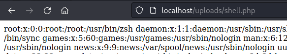
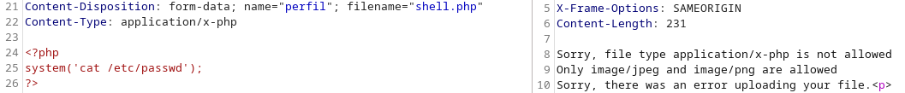
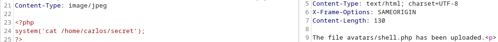

# File Upload (Carga de archivos al servidor)
En ocaciones algunas applicaaciones web nos permiten subir archivos al servidor con el fin de realizar una accion, por ejemplo, una aplicacion web de una galeria de arte de deja subir tus obras de arte 
en formato jpg para que todos puedan verlas, si la forma en que se procesan esas imagenes no es correcta el atacante podra subir distintos tipos de archivos y lograr ejecutar codigo en el servidor.

## Carga de archivos sin restricción
Existe un botón de carga de archivos, por ejemplo la foto de perfil de alguna red social, es posible que este se encuentre restringido al formato deseado por la web, en este caso, jpg o png. Sin embargo, puede ocurrir que no se encuentre restringido de ninguna forma, permitiendonos almacenar una web shell.

A continuacion muestro el codigo php para el cambio de la foto de perfil.
```php
<?php
if ($_SERVER["REQUEST_METHOD"] === "POST") {

    $directorioCarga = 'uploads/';

    if (!file_exists($directorioCarga)) {
        mkdir($directorioCarga, 0777, true);
    }

    $archivoCargado = $directorioCarga . basename($_FILES['file']['name']);

    if (move_uploaded_file($_FILES['file']['tmp_name'], $archivoCargado)) {
        echo '<h2>Foto de Perfil</h2>';
        echo '';
    } 
}
?>
```
Como se puede observar en el codigo anterior, se permite subir un archivo y este se almacena en el directorio ```uploads``` sin embargo no hay ninguna restriccion que nos impida subir cualquier archivo, en este caso subiremos un archivo php que nos permita mostrar el contenido del fichero ```/etc/passwd```



## Carga de archivos saltando la verificación de extención

Ahora en nuestro codigo anterior se agrega una verificacion del archivo permitido de la siguiente forma:
```php
$tipoDeArchivo = strtolower(pathinfo($uploadFile, PATHINFO_EXTENSION));
$ExtencionPermitida = array('jpg', 'jpeg', 'png');
if (in_array($imageFileType, $allowedExtensions)) {
        // Realiza todo el proceso normal
    } else {
        echo 'Solo se permiten archivos JPG, JPEG, PNG';
    }
```
Como podemos observar si el archivo que queremos cargar al servidor no es de tipo jpg, jpeg o png el archivo no podra ser guardado en el servidor, para evitar esto podemos cambiar nuestro nombre de archivo con las siguientes extenciones.

- Utilizando mayusculas:
    + shell.pHp
    + shel.pHP5
- Añadiendo la extencion valida antes de la verdadera:
    + shell.png.php
    + shell.jpg.php
- Utiliza null bytes entre extenciones:
    + shell.php%00.png
    + shell.php%0a.png
 
## Carga de archivos modificando el Content Type Header:

Content-Type es una cabecera (header) en las solicitudes y respuestas HTTP que indica el tipo de medio (media type) de los datos que se están enviando o recibiendo. 
La cabecera Content-Type especifica el formato del contenido y, por lo tanto, ayuda al receptor a interpretar correctamente los datos. Si el servidor hace la validacion del archivo por medio de este Header se puede burlar utilizando una proxy.
En la siguiente imagen se intenta subir un archivo php sin modificarl el content type y se observa que no es permitido:




Ahora modificando el content type se consigue el objetivo:



